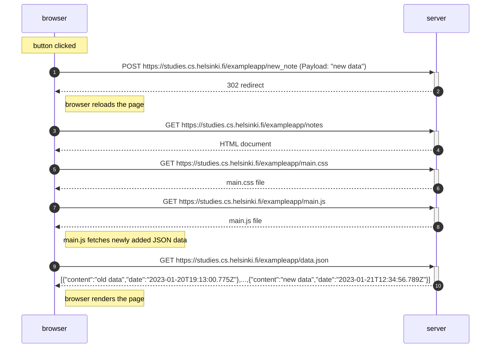

```mermaid
sequenceDiagram
autonumber
participant b as browser
participant s as server

Note over b: button clicked
b->>+s: POST https://studies.cs.helsinki.fi/exampleapp/new_note (Payload: "new data")
s-->>-b: 302 redirect

Note right of b: browser reloads the page
b->>+s: GET https://studies.cs.helsinki.fi/exampleapp/notes
s-->>-b: HTML document

b->>+s: GET https://studies.cs.helsinki.fi/exampleapp/main.css
s-->>-b: main.css file

b->>+s: GET https://studies.cs.helsinki.fi/exampleapp/main.js
s-->>-b: main.js file

Note right of b: main.js fetches newly added JSON data
b->>+s: GET https://studies.cs.helsinki.fi/exampleapp/data.json
s-->>-b: [{"content":"old data","date":"2023-01-20T19:13:00.775Z"},...,{"content":"new data","date":"2023-01-21T12:34:56.789Z"}]

Note right of b: browser renders the page
```
