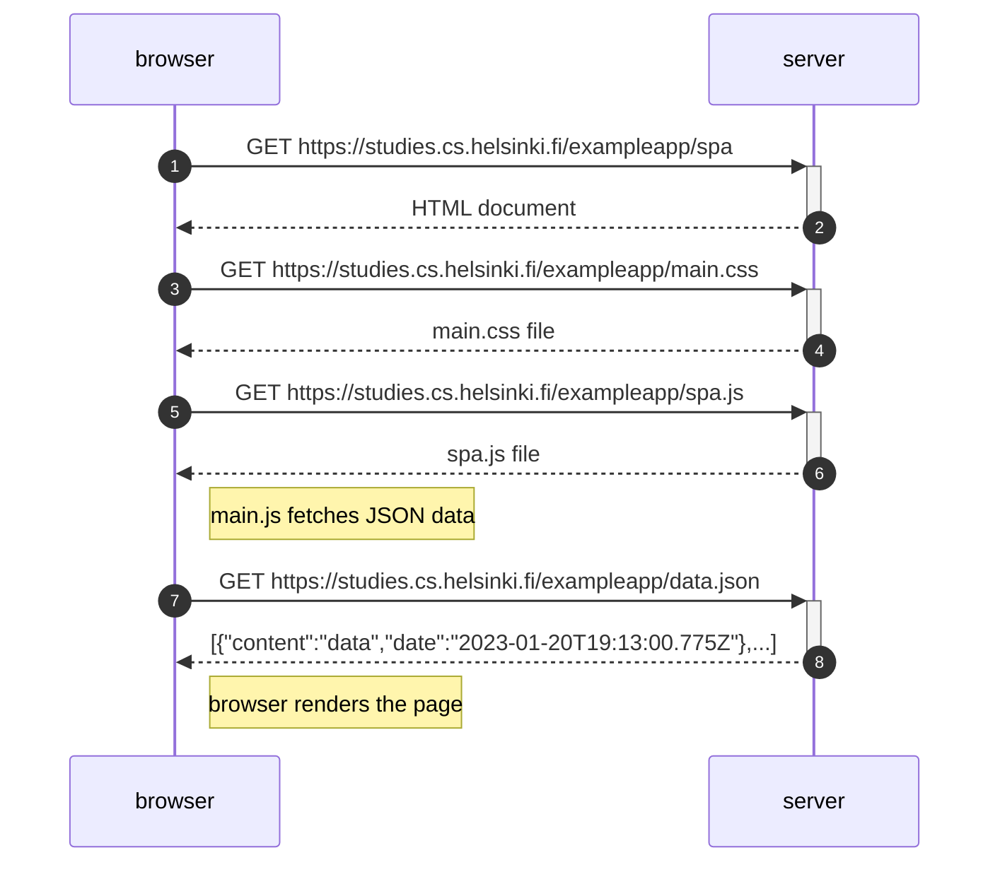

```mermaid
sequenceDiagram
autonumber
participant b as browser
participant s as server

b->>+s: GET https://studies.cs.helsinki.fi/exampleapp/spa
s-->>-b: HTML document

b->>+s: GET https://studies.cs.helsinki.fi/exampleapp/main.css
s-->>-b: main.css file

b->>+s: GET https://studies.cs.helsinki.fi/exampleapp/spa.js
s-->>-b: spa.js file

Note right of b: main.js fetches JSON data
b->>+s: GET https://studies.cs.helsinki.fi/exampleapp/data.json
s-->>-b: [{"content":"data","date":"2023-01-20T19:13:00.775Z"},...]

Note right of b: browser renders the page
```
