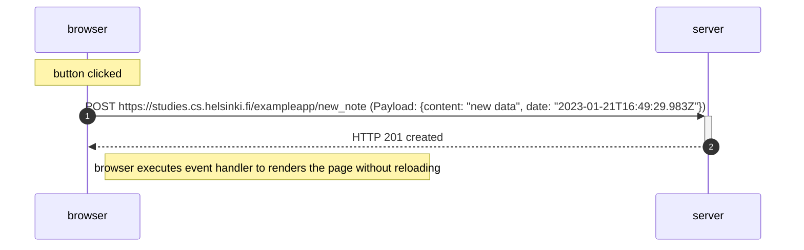

```mermaid
sequenceDiagram
autonumber
participant b as browser
participant s as server

Note over b: button clicked
b->>+s: POST https://studies.cs.helsinki.fi/exampleapp/new_note (Payload: {content: "new data", date: "2023-01-21T16:49:29.983Z"})
s-->>-b: HTTP 201 created

Note right of b: browser executes event handler to renders the page without reloading
```
